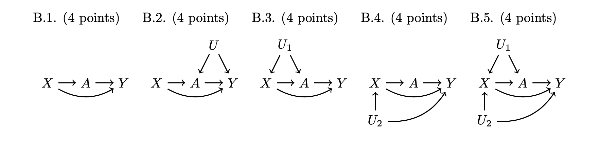

# Problem Set 4. Intervening to Equalize Opportunity

**Info 3370. Studying Social Inequality with Data Science. Spring 2023**

**Due: 5pm on 21 Apr 2023. Submit on
[Canvas](https://canvas.cornell.edu/courses/51595).**

> After grades are released: If you think you have been graded in error, we will only consider regrade requests submitted [here](https://docs.google.com/forms/d/e/1FAIpQLSecmTna0y7OoELhz14pulJpVelAacCIJ4KE-Dx6O3xCirUwaA/viewform). All requests must be submitted within 72 hours of grade release.

Welcome to the fourth problem set! This problem set is about causal
inference methods to study an intervention (a college degree) that might
help to equalize economic opportunity.

- Before you begin, you download and unzip
  [**pset4.zip**](https://info3370.github.io/assets/assignments/pset4.zip).
  This contains several files that will be put in one working directory.
  Use the included .Rmd to complete the assignment
- In Canvas, you will upload the PDF produced by your .Rmd file
- Don’t put your name on the problem set. We want anonymous grading to
  be possible
- We’re here to help! Reach out using Ed Discussion or office hours

The header of this problem set has a few steps to get you set up, which
we have streamlined as much as possible so you can focus on the causal
problems.

## Data access

This problem set uses data from the National Longitudinal Survey of
Youth 1997 (NLSY97). The NLSY97 began with a probability sample of U.S.
non-institutionalized youths ages 12–17 in 1997, and has followed them
in repeated interviews through 2019.

To access data, you will

1.  Visit the [**NLS
    Investigator**](https://www.nlsinfo.org/investigator/pages/search#)
    and register for an account
2.  Log in. Choose the NLSY97 study and the substudy “NLSY97 1997–2019
    (rounds 1–19).”
3.  Under “Choose Tagsets”, find where it says “Upload Tagset.” Click
    “Choose File” and upload our tagset: `pset4.NLSY97`, which is part
    of the zipped folder you downloaded for this problem set. This will
    load the variables we will use into your session.
4.  Click “Save/Download” -\> “Advanced Download”. Check the box for “R
    Source code” and any other boxes you want. In the filename box, type
    “pset4” and click “Download.”
5.  Move the downloaded file `pset4.dat` into the unzipped folder you
    downloaded for this problem set

Note: The file you download will be under 200KB.

## Data preparation

You’ve done data preparation in previous homework, so we don’t want that
to take your time now. We made some code to help. Put your downloaded
`pset4.dat` file in the directory where this .Rmd is located. The code
below will prepare a data file for you.

``` r
library(tidyverse)
source("pset4_prep.R")
```

The resulting data file `d` contains several variables:

- `respondent_college` is our treatment. It indicates whether the
  respondent completed a four-year college degree
- `fulltime_2019` is the outcome variable, which indicates whether the
  respondent was employed at least 30 hours per week at the time of the
  2019 interview
- `sex` coded `Female` and `Mle`
- `race` coded `Black`, `Hispanic`, `White / Other`
- `parent_college` indicates whether the respondent’s parent completed
  college
- `mom_age_at_birth` is the respondent’s mother’s age at the birth of
  the respondent
- `children_under_18` is the number of children under 18 in the
  respondent’s household in the 1997 survey
- `two_parent_household` indicates whether the parent lived with two
  residential parents in 1997, where parent is defined to include
  non-biological residential parents
- `region` is coded in four U.S. regions for residence in 1997
- `urban` indicates residence in an urban area in 1997
- `income_1997` is gross household income in 1997

# Part 1 (10 points). Nonparametric estimation

We will estimate the causal effect of the respondent completing college
on whether that respondent works full-time in the 2019 interview. To
practice nonparametric estimation, we will assume at first that the only
confounder is whether the parent completed collge.

- Estimate the causal effect of `respondent_college` on `fulltime_2019`
  by conducting analysis within subgroups defined by `parent_college`
- Report the conditional average causal effect in each of these two
  subgroups (a printout from R is fine)

``` r
# your code here
```

# Part 2 (25 points). Parametric estimation with logistic regression

## 2.1 (4 points). Estimate a statistical model

Estimate a logistic regression model (a `glm()` with
`family = binomial`) predicting full-time employment in 2019. For your
model formula, interact `respondent_college` with an additive function
of all confounders.

> Hint: You could use the model formula
> `fulltime_2019 ~ respondent_college*(.)`, where the `.` tells R to
> include all the variables there.

``` r
# your code here
```

## 2.2 (5 points). Predict potential outcomes

Create data frames with counterfactual treatment values of interest:
`respondent_college = TRUE` and `respondent_college = FALSE`.

``` r
# your code here
```

Predict the potential outcome under each treatment condition, and
difference to estimate the conditional average causal effect at the
confounder values of each respondent.

``` r
# your code here
```

## 2.3 (4 points). Average effect by parent_college

Report the conditional average effect within subgroups defined by
`parent_college`. A printout is fine. Interpret the two estimates in a
sentence written so that a parent reading the Cornell Daily Sun could
understand.

``` r
# your code here
```

Your interpretation here.

## 2.4 (4 points) Histogram of conditional average effects

Create a histogram (`geom_histogram()`) showing the full distribution of
estimated conditional average causal effects. Interpret in a sentence
that a parent reading the Cornell Daily Sun could understand.

``` r
# your code here
```

Your interpretation here.

## 2.5 (4 points) Scatterplot of conditional average effects

Create a scatterplot with `income_1997` on the $x$-axis and the
estimated conditional average causal effect on the $y$-axis. Someone
might expect these points to fall all on a single curve. Why don’t they?
In other words, why do effects vary among those with the same family
income?

``` r
# your code here
```

## 2.6 (4 points) Your choice

Choose some other confounding variable. Visualize how the conditional
average causal effect of college varies as a function of that variable.

# Part 3 (15 points). Summarizing the big ideas.

On Canvas under “Files”, you will find a PDF draft of a forthcoming book
that we have permission to read internally as a class but not share more
broadly.

> Brand, Jennie E. 2023. *Overcoming the Odds: The Benefits of
> Completing College for Unlikely College Graduates.* New York: Russell
> Sage Foundation.

The ideas in this book have inspired much of this problem set. Read the
following selections. Note that pages are internally numbered within
each chapter.

- Ch 1 p. 2-7 (the intro to the book)
- Ch 3 p. 1-6 (intro to chapter 3 and the section “Counterfactuals and
  potential outcomes”)
- Ch 3 p. 19-23 (the section “Identifying effects of college
  completion”)

Consider our discussions in class and the ideas in this reading. In a
paragraph written to someone who knows nothing about causal inference,
explain

- What is the college counterfactual? Why is it so helpful to think this
  way, as opposed to in comparisons across people who go to college and
  those who do not? Try to explain as though writing to someone who has
  neither read the book nor studied causal inference.
- What makes the search for effect heterogeneity particularly worthwhile
  when research may inform policy about college access?

Your answer here.

# Bonus (20 points). Fun with DAGs

The bonus is required for graduate students and optional (no extra
credit) for undergraduate students.

For each DAG below, answer True or False: X is a sufficient adjustment
set to identify the causal effect of A on Y. Recall that X is
insufficient if a backdoor path between A and Y remains unblocked
conditional on X. If False, state the backdoor path that is unblocked
conditional on X.


