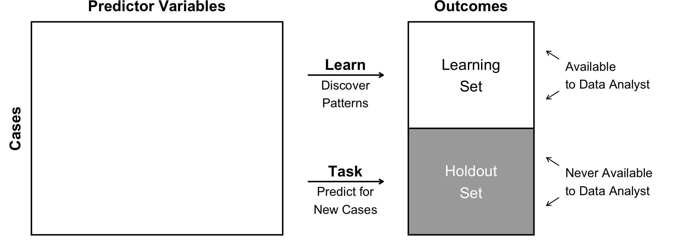
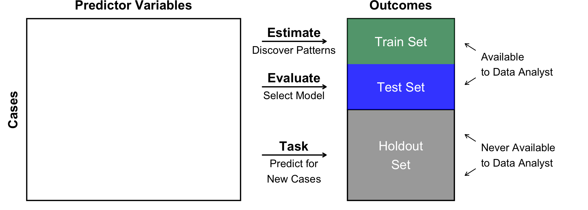

# Train-test split: Evaluate out-of-sample prediction

In supervised machine learning, the goal is to

- learn patterns in the available data
- predict outcomes for previously unseen cases

(in this exercise, optimizing mean squared error)

How do we know which method will do this well? This exercise introduces
a key principle of machine learning.

> **Key principle.** When a task involves unseen data, try to mimic that
> task with data you already have. Pick the method that performs best on
> your mimic task.

In this case, our goal is to predict the unseen outcomes in a holdout
set.

<!-- -->

Using the learning set, we would like to mimic the task: use each
candidate algorithm predict previously unseen observations. We can
accomplish this by a **sample split** within the learning set.

<!-- -->

The rest of this page illustrates how a train-test split can be done in
R. To get started, you’ll want the `tidyverse` package and also the
`rsample` package, which we will use to make the split. Because we will
be using a random sample, use `set.seed()` with a number of your
choosing to ensure reproducibility.

``` r
library(tidyverse)
library(rsample)
set.seed(14850)
```

## 1. Load the data

To get started, load the data that we are using in this module. See the
previous pages for data access.

``` r
learning <- read_csv("learning.csv")
holdout_public <- read_csv("holdout_public.csv")
```

## 2. Create a train-test split

In the `rsample` package, the `initial_split()` function will create a
split. The `training()` and `testing()` functions will create data
frames for the train and test set.

``` r
# Split the learning set into train and test
learning_split <- learning %>%
  initial_split(prop = 0.5)
train <- training(learning_split)
test <- testing(learning_split)
```

## 3. Learn candidate prediction functions on the train set

We will illustrate with OLS. We will consider

1.  Parent income
2.  Parent income, race, and sex entered additively
3.  Model (2) entered interactively, so that the pattern between parent
    income and respondent income may differ in every subgroup defined by
    race and sex

``` r
candidate_1 <- lm(g3_log_income ~ g2_log_income,
                  data = train)
candidate_2 <- lm(g3_log_income ~ g2_log_income + race + sex,
                  data = train)
candidate_3 <- lm(g3_log_income ~ g2_log_income * race * sex,
                  data = train)
```

## 4. Evaluate predictive performance on the test set

``` r
test %>%
  # Make predictions from the models
  mutate(candidate_1 = predict(candidate_1, newdata = test),
         candidate_2 = predict(candidate_2, newdata = test),
         candidate_3 = predict(candidate_3, newdata = test)) %>%
  # Pivot longer so we can summarize them all in one line
  pivot_longer(cols = starts_with("candidate"),
               names_to = "model", values_to = "yhat") %>%
  group_by(model) %>%
  # Calculate prediction error
  mutate(error = g3_log_income - yhat) %>%
  # Calculate squared prediction error
  mutate(squared_error = error ^ 2) %>%
  # Calculate mean squared error
  summarize(mse = mean(squared_error))
```

    ## # A tibble: 3 × 2
    ##   model         mse
    ##   <chr>       <dbl>
    ## 1 candidate_1 0.439
    ## 2 candidate_2 0.437
    ## 3 candidate_3 0.477

The best predictor is the one with the lowest mean squared error:
Candidate 2!

This result might surprise you—after all, Candidate 3 is a strictly more
flexible model than Candidate 2. In fact, if we evaluated predictions on
the train set we would have chosen candidate 3.

    ## # A tibble: 3 × 2
    ##   model       train_set_mse
    ##   <chr>               <dbl>
    ## 1 candidate_1         0.474
    ## 2 candidate_2         0.472
    ## 3 candidate_3         0.462

The reason Candidate 3 performs well on the train set but less well on
the test set is that it (like all flexible models) is prone to
over-fitting: it is so flexible that it discovers patterns that exist in
the train set but which do not generalize to other cases from the same
population. Thus it performs poorly in the test set, and by extension
would likely perform poorly in the holdout set! This is why sample
splitting is important for model selection.

## 5. Estimate the chosen model in the full learning set and predict in the holdout set

Once we have chosen our model, we should now drop the sample split. Use
the entire learning set to estimate that chosen model with all the data
available to us.

``` r
chosen <- lm(g3_log_income ~ g2_log_income + race + sex,
             data = learning)
```

Then predict for the holdout set.

``` r
predicted <- holdout_public %>%
  mutate(predicted = predict(chosen, newdata = holdout_public))
```

## Summary

When our goal is to predict for new cases, we should select a model that
performs well when we mimic that task within the data available to us.
One way to mimic the task is a train-test split: within the learning
set, set aside part of the data for learning candidate models and
another part for picking the best among the candidates.
