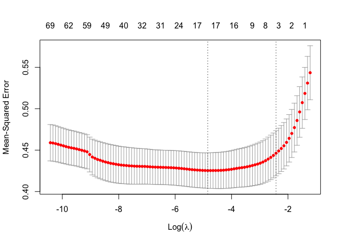

# Machine learning: Regularized regression with glmnet

If we use all the predictors, we might have poor performance because of
overfitting: close fitting in the learning sample that does not
generalize well to new cases. We might want to **regularize** the
coefficients, pulling the estimates toward 0 so that they are less
sensitive to the training sample.

The `glmnet` package supports this type of estimation. Start by
preparing the environment.

``` r
library(tidyverse)
library(glmnet)
learning <- read_csv("learning.csv")
holdout_public <- read_csv("holdout_public.csv")
```

If you type `?glmnet`, you will see that the function requires arguments
`x` and `y` rather than a model formula. The argument `x` is a matrix of
predictors. We can generate that for the learning and holdout sets with
code like this.

For this example, we will assume a complicated model formula, including
the 4-way

``` r
formula_of_predictors <- formula(~ -1 + (g2_log_income + g1_log_income)*g3_educ*race*sex)
X_learning <- model.matrix(formula_of_predictors,
                        data = learning)
X_holdout <- model.matrix(formula_of_predictors,
                          data = holdout_public)
```

We also need to define the vector of outcomes in the learning set.

``` r
y_learning <- learning$g3_log_income
```

Now we are ready to learn a model. We’ll use `cv.glmnet` which will
internally use cross validation to assess the predictive performance of
models with various penalties.

``` r
fit <- cv.glmnet(x = X_learning,
                 y = y_learning)
```

Typing `plot(fit)` will visualize prediction error as a function of the
penalty parameter $\lambda$.
<!-- -->

What does this penalty do? It shrinks many of the coefficients to 0,
effectively dropping those predictors out of the model. Focusing on the
penalty $\lambda$ that minimizes out-of-sample prediction error, you can
see the many dropped coefficients with `coef(fit, s = "lambda.min")`.

We might want to make predictions at the minimum of that curve.

``` r
fitted <- holdout_public %>%
  mutate(g3_log_income = predict(fit,
                                 newx = X_holdout,
                                 s = "lambda.min"))
```

To learn more, I would recommend

- Hastie, Qian, and Tay. 2021. [An introduction to
  `glmnet`](https://glmnet.stanford.edu/articles/glmnet.html)
