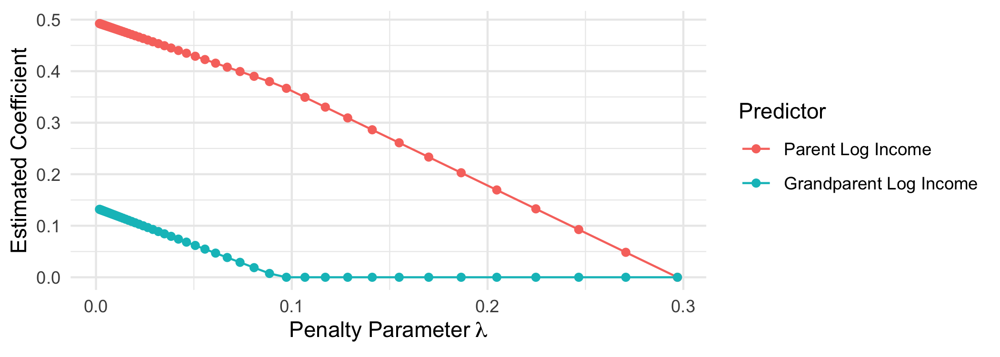
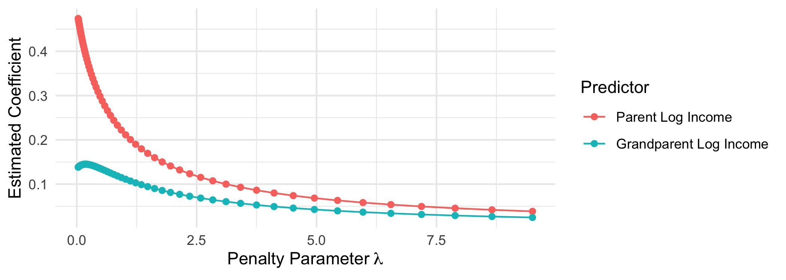

# Machine learning: Regularized regression with glmnet

When predicting an outcome, it is tempting to include many predictors
and their interactions. Doing so accords with two beliefs: (1) many
things matter and (2) patterns may differ across population subgroups.
Yet when the sample size is small, the resulting model can be highly
sensitive to the particular sample used for estimation. It may not
generalize well to new cases. The [sample splitting
lesson](https://info3370.github.io/lessonplans/7d/) introduced this
issue.

Regularized regression offers a way out

- estimate a model with many predictors
- to the degree that you are uncertain, pull the coefficient estimates
  toward 0

This approach yields biased estimates that are less sensitive to the
training sample. It is possible that biased, low-variance estimate are
better predictions than unbiased, high-variance estimates. The
[`glmnet`](https://glmnet.stanford.edu/articles/glmnet.html) package
supports this type of estimation. Begin by loading data.

``` r
library(tidyverse)
library(glmnet)
learning <- read_csv("learning.csv")
holdout_public <- read_csv("holdout_public.csv")
```

Type `?glmnet`, and you will see that the function requires arguments

- `x` a matrix of predictors
- `y` a vector of outcome values

## Create the predictor matrix and outcome vector

We can create `x` using the `model.matrix` function, which has two
arguments

- a model formula
  - `-1` excludes the intercept (because `glmnet` will make an intercept
    for us)
  - `g2_log_income` is parent income
  - `g1_log_income` is grandparent income
- a data frame containing variables

``` r
X <- model.matrix(~ -1 + g2_log_income + g1_log_income,
                  data = learning)
```

We can create the outcome vector `y` by pulling that column (respondent
income `g3_log_income`) from the data frame.

``` r
y <- learning$g3_log_income
```

## Fit the model: LASSO regression

We can then fit a `glmnet` model.

``` r
fit <- glmnet(x = X, y = y)
```

By default, the model is [LASSO
regression](https://en.wikipedia.org/wiki/Lasso_(statistics)), which
minimize a loss function:

<!-- -->

The loss function has two parts

- squared prediction error
- a penalty on large coefficients, scaled by the tuning parameter
  lambda

By default, `glmnet` estimates coefficients at a whole series of values
for the penalty parameter lambda.

<!-- -->

When the penalty parameter lambda is small, the prediction error
dominates the loss function. At the far left, we get coefficients that
are the same as we would get from OLS.

When the penalty parameter lambda is large, the penalty term
dominates the loss function. At penalty parametesr above
$\lambda \approx .1$ the coefficient on grandparent log income is
regularized to 0—this predictor drops out of the model entirely. By
$\lambda \approx .3$, both estimated coefficients are 0 and the model
collapses on predicting the mean outcome for everyone.

## Fit the model: Ridge regression

[Ridge regression](https://en.wikipedia.org/wiki/Ridge_regression) is an
alternative that penalizes the sum of squared coefficients.

<!-- -->

Ridge regression heavily penalizes large coefficients: when $\beta_j$ is
large, then its squared value is especially large. Ridge regression
places almost no penalty on small coefficients: when $\beta_j$ is almost
0, then $\beta_j^2$ is very close to 0. For this reason, the LASSO
penalty term causes some coefficents to fall to exactly 0 whereas the
ridge penalty term does not.

To fit ridge regression, use the argument `alpha = 0`.

``` r
fit <- glmnet(x = X, y = y, alpha = 0)
```

This approach quickly pulls down large coefficients but never pulls
coefficients exactly to zero.

<!-- -->

## Applied illustration: Many candidate predictors

Regularized regression is especially helpful in cases with many
predictors. For instance, we might want to parents’ and grandparents’
incomes to interact with education, race, and sex.

``` r
formula_of_predictors <- formula(~ -1 + (g2_log_income + g1_log_income)*g3_educ*race*sex)
X <- model.matrix(formula_of_predictors,
                  data = learning)
```

This model has 72 predictors! With only 1365 observations, a model
without regularization could be highly sensitive to the training sample
and may not generalize well to out-of-sample cases.

### What penalty parameter value to choose?

With `glmnet`, we can achieve automatic regularization. Here, we use the
`cv.glmnet` function to automatically select the value of lambda that
minimizes out-of-sample prediction error. Internally, this function uses
[cross
validation](https://en.wikipedia.org/wiki/Cross-validation_(statistics))
which is a generalization of a train-test split.

``` r
fit <- cv.glmnet(x = X, y = y)
```

We can then use the `plot()` function to see the cross-validated mean
squared error estimates at each penalty parameter value. We might then
choose to focus on the lambda value that minimizes this prediction
error.

``` r
plot(fit)
```

<!-- --> By typing
`coef(fit, s = "lambda.min")`, you can see the estimated coefficients at
the penalty parameter that minimizes cross-validated prediction error.
In this case, LASSO has simplifed to 12 non-zero coefficients out of the
72 candidate predictors.

### Predict for the holdout set

To predict for new cases, create a new matrix of predictors in the
holdout set

``` r
X_holdout <- model.matrix(formula_of_predictors,
                          data = holdout_public)
```

and predict for those cases.

``` r
yhat_holdout <- predict(fit, 
                        newx = X_holdout,
                        s = "lambda.min")
```

If you want to put that in a data frame, note that `yhat_holdout` is a
matrix with 1 column. You may want to extract the vector
`yhat_holdout[,1]` to put into the `holdout_public` data frame.

## Where to learn more

To learn more, I would recommend

- Hastie, Qian, and Tay. 2021. [An introduction to
  `glmnet`](https://glmnet.stanford.edu/articles/glmnet.html).
  
## Summary video: What we covered today


