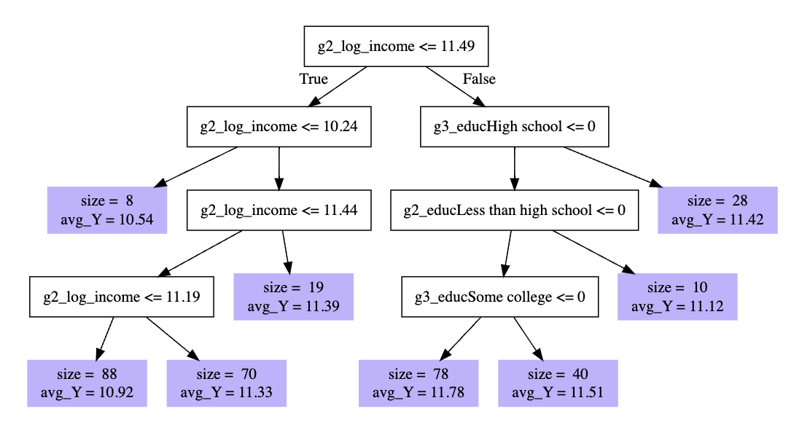

# Machine learning: Interactive nonlinearity via random forest with grf

Perhaps we think that predictors may interact: the response to one
predictor differs greatly as a function of the values of the other
predictor. Random forests are a method that can discover interactions in
data.

The `grf` package supports this type of estimation. Start by preparing
the environment.

``` r
library(tidyverse)
library(grf)
learning <- read_csv("learning.csv")
holdout_public <- read_csv("holdout_public.csv")
```

## The base of a random forest: Decision trees

To understand a random forest, you first need to understand a decision
tree. Below is a decision tree applied to our data.



What happened there? A high level take

- the algorithm looked over all predictors and values to find a
  **split** that would reduce mean squared prediction error
- it first split into those with `g2_log_income <= 11.49` and everyone
  else
- within each subgroup, it then found another useful split
- it continued down the branches of the tree to the leaves (purple)

Each leaf is an interactive function of predictors.

> Example: At the far right is a leaf with 28 observations who have
> `g2_log_income > 11.49` and whose grandparents’ education is not equal
> to high school.

For a new case, we would drop it down the branches until we landed in a
leaf. The prediction is the average outcome of the training cases who
also landed in that leaf.

## From trees to a forest

A random forest is an ensemble of trees. Repeatedly, the algorithm
samples cases and samples variables. For each repetition, it grows a
tree. The prediction from the forest is the average over many trees. The
key advantage of a forest is that the predictions are more stable (less
sensitive to perturbations to the sample) than are individual trees.

## Using grf to learn a forest

The code below estimates a forest using the `grf` package.

``` r
library(grf)
```

First, define a formula of predictors

``` r
formula_of_predictors <- formula(~ -1 + race + sex + 
                                   g1_educ + g2_educ + g3_educ + 
                                   g1_log_income + g2_log_income)
```

Then, create a matrix of predictors in the learning and holdout sets.

``` r
X_learning <- model.matrix(formula_of_predictors,
                           data = learning)
X_holdout <- model.matrix(formula_of_predictors,
                          data = holdout_public)
```

Define the outcome in the learning set.

``` r
y_learning <- learning$g3_log_income
```

Fit the forest

``` r
fit <- regression_forest(X = X_learning,
                         Y = y_learning,
                         tune.parameters = "all")
```

Make predictions for the holdout set

``` r
fitted.grf <- predict(fit, 
                      newdata = X_holdout)
fitted <- holdout_public %>%
  mutate(g3_log_income = fitted.grf$predictions)
```

To learn more, I would recommend

- Tibshirani et al. [Generalized Random
  Forest](https://grf-labs.github.io/grf/index.html). Software website
  with tutorials.
- Athey, Tibshirani, and Wager. 2019. [Generalized random forests](https://projecteuclid.org/journals/annals-of-statistics/volume-47/issue-2/Generalized-random-forests/10.1214/18-AOS1709.full). Annals of Statistics 47(2):1148-1178.
