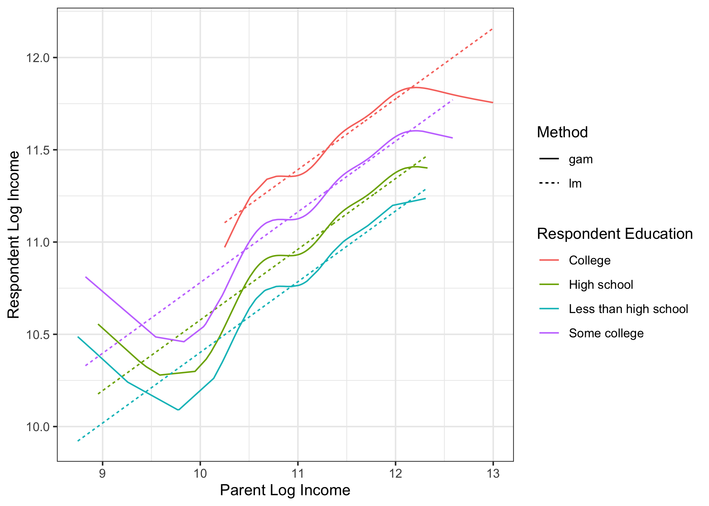

# Machine learning: Nonlinear smooths with mgcv

Standard linear models assume that the response is a linear, additive
function of predictors. Splines relax the first part of that assumption:
perhaps we want to assume that children’s incomes are a nonlinear
function of their parents’ and grandparents’ incomes.

The `mgcv` package supports this type of estimation. Start by preparing
the environment.

``` r
library(tidyverse)
library(mgcv)
learning <- read_csv("learning.csv")
holdout_public <- read_csv("holdout_public.csv")
```

Now, fit a `gam()` object with the `mgcv` package. This example asks R
to predict respondent income (`g3_log_income`) as a smooth but
potentially nonlinear function of parent income (`g2_log_income`) plus a
function of respondent education (`g3_educ`).

``` r
fit <- gam(g3_log_income ~ s(g2_log_income) + g3_educ,
           data = learning)
```

Predict in the holdout set exactly as you would with OLS.

``` r
fitted <- holdout_public %>%
  mutate(g3_log_income = predict(fit, newdata = holdout_public))
```

In this case, the nonlinearity we detect might be mostly noise; it is
possible that OLS is in fact the better algorithm!

<!-- -->

To learn more, I would recommend

- typing `library(mgcv)` and then `?gam` in your R console
- Wood, Simon. 2006. [Generalized Additive Models: An Introduction with
  R](https://newcatalog.library.cornell.edu/catalog/5774517).
- Wood’s website of [supporting
  materials](https://www.maths.ed.ac.uk/~swood34/mgcv/)

## Summary video: What we covered today


